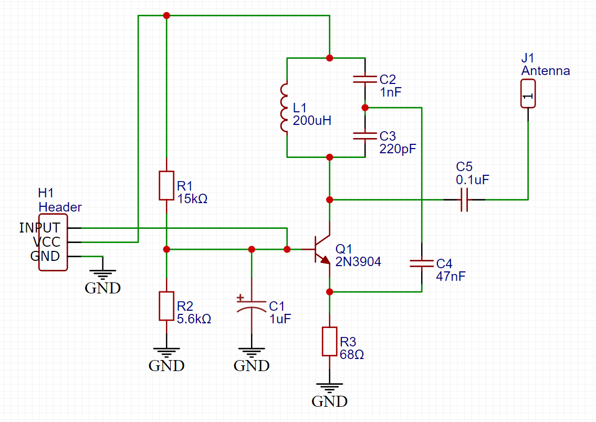
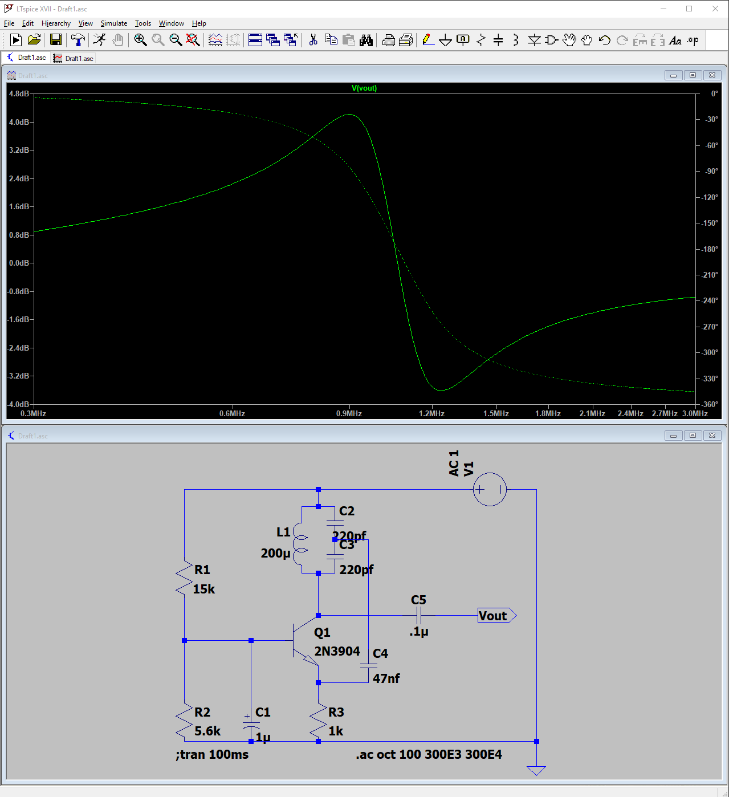
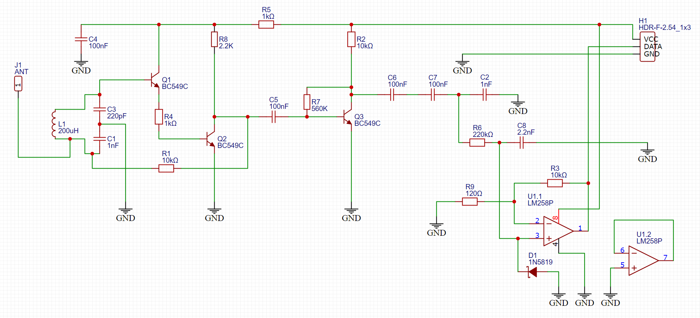
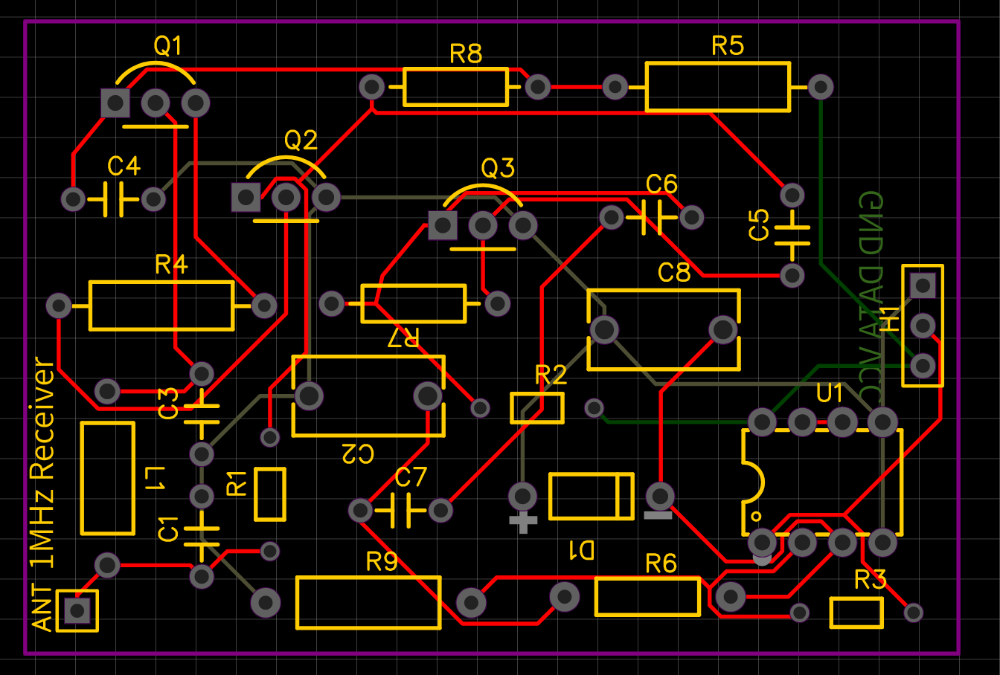

# 1MHz-Digital-Transmitter-and-Receiver
A custom 1MHz digital transmitter and receiver, including the schematics and wiring diagrams.

## Transmitter Details
Schematic and wiring diagram for the transmitter: https://easyeda.com/testuser123456/1MHz-ASK-OOK-Transmitter

### Build of Materials
- Ceramic Capacitors
  - 1nf, C2
  - 220pf, C3
  - 47nf, C4
  - 100nf, C5
- Electrolytic Capacitor
  - 1uf, C1
- Header, H1
- Antenna, J1
- Inductor
- 200uh, L1
- Transistor
  - 2N3904, Q1
- Resistors
  - 15kΩ, R1
  - 5.6kΩ, R2
  - 68Ω, R3

### Pictures of Diagrams and Final Product

**Transmitter Schematic:**

**Transmitter Wiring Diagram:**

**Transmitter LTSpice Simulation:**

## Receiver Details
Schematic and wiring diagram for the receiver: https://easyeda.com/testuser123456/1mhz-ask-ook-receiver

### Build of Materials
- Blah
- 

### Pictures of Diagrams and Final Product

**Receiver Schematic:**

**Receiver Wiring Diagram:**

**Received Signal Over Oscilloscope:**

