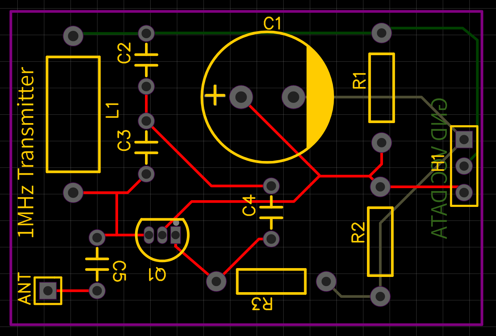

# 1MHz-Digital-Transmitter-and-Receiver
A custom 1MHz digital transmitter and receiver, including the schematics and wiring diagrams.

## Transmitter Details
Schematic and wiring diagram for the transmitter: https://easyeda.com/testuser123456/1MHz-ASK-OOK-Transmitter

### Build of Materials
- Ceramic Capacitors
  - 1nf, C2
  - 220pf, C3
  - 47nf, C4
  - 100nf, C5
- Electrolytic Capacitor
  - 1uf, C1
- Header, H1
- Antenna, J1
  - Loop Antenna: https://www.amazon.com/gp/product/B0987HGYMM/ref=ppx_yo_dt_b_search_asin_title?ie=UTF8&psc=1
- Inductor
- 200uh, L1
- Transistor
  - 2N3904, Q1
- Resistors
  - 15kΩ, R1
  - 5.6kΩ, R2
  - 68Ω, R3

### Pictures of Diagrams and Final Product

**Transmitter Schematic:**

**Transmitter Wiring Diagram:**

**Transmitter LTSpice Simulation:**

**Transmitter Perma-board:**

**Transmitter PCB:**

## Receiver Details
Schematic and wiring diagram for the receiver: https://easyeda.com/testuser123456/1mhz-ask-ook-receiver

### Build of Materials
- Ceramic Capacitors
  - 1nf, C1, C2
  - 220pf, C3
  - 100nf, C4, C5, C6, C7
  - 2.2nf, C8
- Diode
  - 1N5819, D1
- Header, H1
- Antenna, J1
  - Loop Antenna: https://www.amazon.com/gp/product/B0987HGYMM/ref=ppx_yo_dt_b_search_asin_title?ie=UTF8&psc=1
- Inductor
  - 200uh, L1
- Transistors
  - BC549C, Q1, Q2, Q3
- Resistors
  - 10kΩ, R1, R2, R3
  - 1kΩ, R4, R5
  - 220kΩ, R6
  - 560kΩ, R7
  - 2.2kΩ, R8
  - 120Ω, R9
- Amplifier Circuit
  - LM258P, U1

### Pictures of Diagrams and Final Product

**Receiver Schematic:**

**Receiver Wiring Diagram:**

**Received Signal Over Oscilloscope:**

**Receiver Perma-board:**

**Receiver PCB:**

